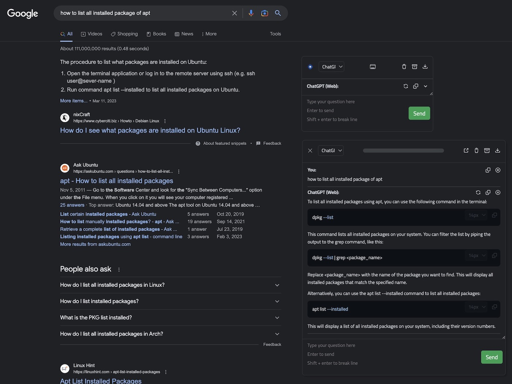
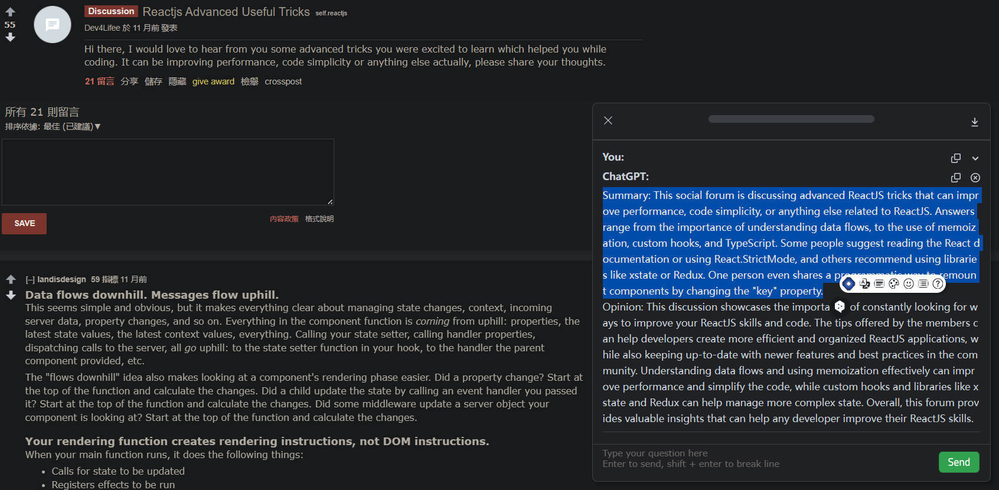
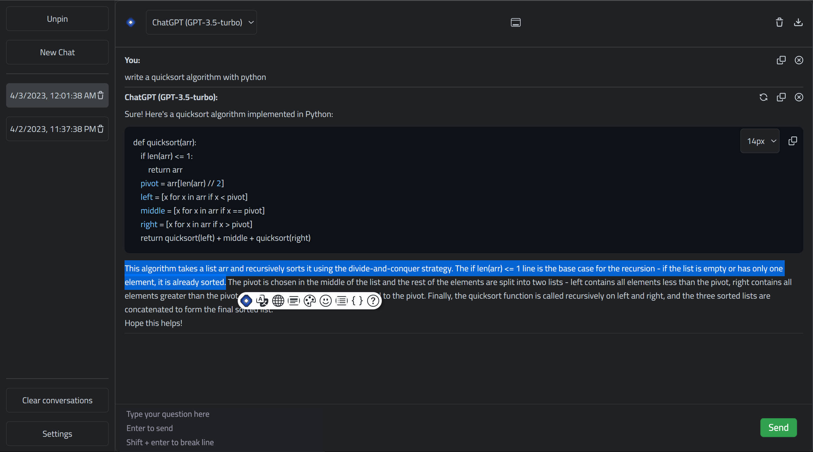
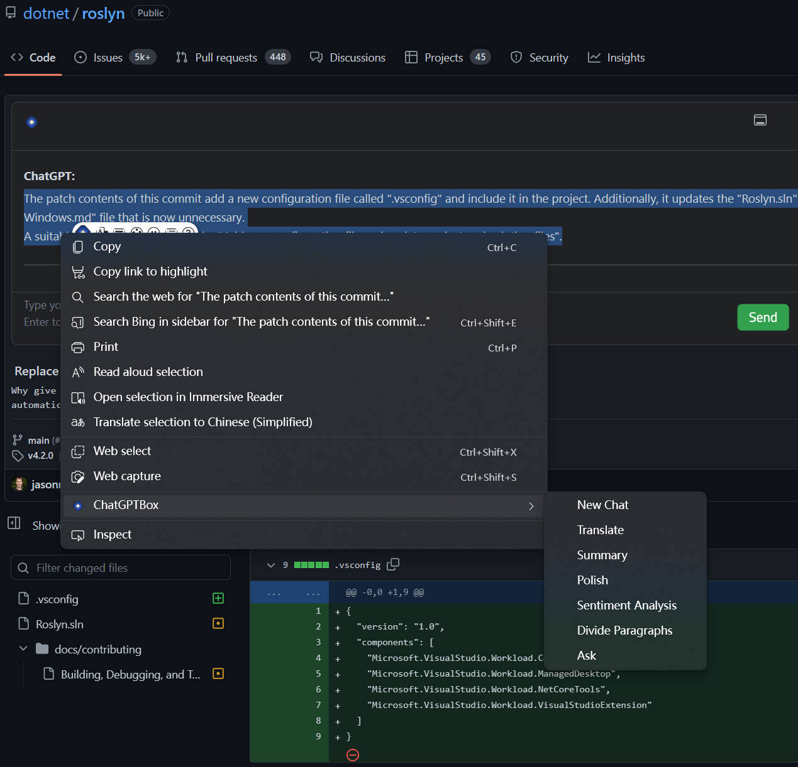
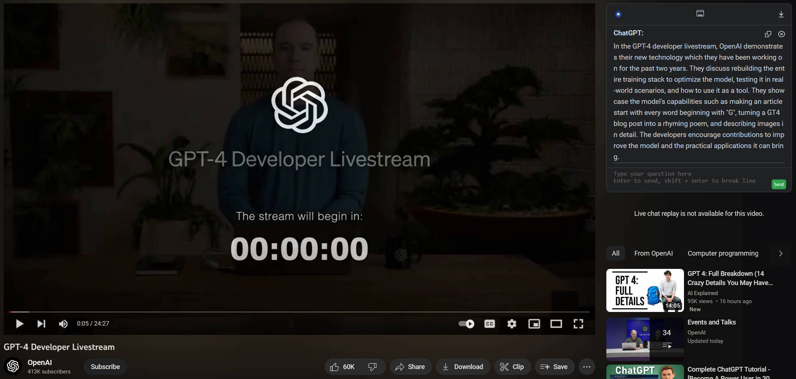
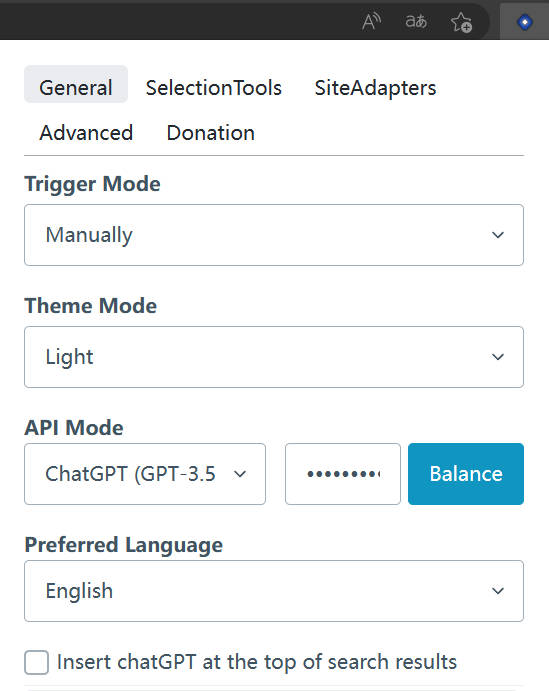

    

<h1 align="center">ChatGPT Box</h1>

Integrasi Deep ChatGPT di browser Anda, sepenuhnya gratis.

[![license][license-image]][license-url]
[![release][release-image]][release-url]
[][release-url]
[![verfiy][verify-image]][verify-url]

[Inggris](README.md) &nbsp;&nbsp;|&nbsp;&nbsp; Indonesia &nbsp;&nbsp;|&nbsp;&nbsp; [简体中文](README_ZH.md) &nbsp;&nbsp;|&nbsp;&nbsp; [日本語](README_JA.md) &nbsp;&nbsp;|&nbsp;&nbsp; [Türkçe](README_TR.md)

### Install

[![Chrome][Chrome-image]][Chrome-url]
[![Edge][Edge-image]][Edge-url]
[![Firefox][Firefox-image]][Firefox-url]
[![Safari][Safari-image]][Safari-url]
[![Android][Android-image]][Android-url]
[![Github][Github-image]][Github-url]

[Panduan](https://github.com/josStorer/chatGPTBox/wiki/Guide) &nbsp;&nbsp;|&nbsp;&nbsp; [Pratinjau](#Pratinjau) &nbsp;&nbsp;|&nbsp;&nbsp; [Pengembangan & Berkontribusi][dev-url] &nbsp;&nbsp;|&nbsp;&nbsp; [Demonstrasi Video](https://www.youtube.com/watch?v=E1smDxJvTRs) &nbsp;&nbsp;|&nbsp;&nbsp; [Kredit](#Kredit)

[dev-url]: https://github.com/josStorer/chatGPTBox/wiki/Development&Contributing

[license-image]: http://img.shields.io/badge/license-MIT-blue.svg

[license-url]: https://github.com/josStorer/chatGPTBox/blob/master/LICENSE

[release-image]: https://img.shields.io/github/release/josStorer/chatGPTBox.svg

[release-url]: https://github.com/josStorer/chatGPTBox/releases/latest

[verify-image]: https://github.com/josStorer/chatGPTBox/workflows/verify-configs/badge.svg

[verify-url]: https://github.com/josStorer/chatGPTBox/actions/workflows/verify-configs.yml

[Chrome-image]: https://img.shields.io/badge/-Chrome-brightgreen?logo=google-chrome&logoColor=white

[Chrome-url]: https://chrome.google.com/webstore/detail/chatgptbox/eobbhoofkanlmddnplfhnmkfbnlhpbbo

[Edge-image]: https://img.shields.io/badge/-Edge-blue?logo=microsoft-edge&logoColor=white

[Edge-url]: https://microsoftedge.microsoft.com/addons/detail/fission-chatbox-best/enjmfilpkbbabhgeoadmdpjjpnahkogf

[Firefox-image]: https://img.shields.io/badge/-Firefox-orange?logo=firefox-browser&logoColor=white

[Firefox-url]: https://addons.mozilla.org/firefox/addon/chatgptbox/

[Safari-image]: https://img.shields.io/badge/-Safari-blue?logo=safari&logoColor=white

[Safari-url]: https://apps.apple.com/app/fission-chatbox/id6446611121

[Android-image]: https://img.shields.io/badge/-Android-brightgreen?logo=android&logoColor=white

[Android-url]: https://github.com/josStorer/chatGPTBox/wiki/Install#install-to-android

[Github-image]: https://img.shields.io/badge/-Github-black?logo=github&logoColor=white

[Github-url]: https://github.com/josStorer/chatGPTBox/wiki/Install

#### Proyek baru saya [RWKV-Runner](https://github.com/josStorer/RWKV-Runner) telah dirilis, sebuah alat model bahasa besar sumber terbuka yang tersedia secara komersial dan dapat diterapkan dengan sekali klik yang dapat digunakan bersama dengan ChatGPTBox.

## Berita

- Ekstensi ini **tidak** mengumpulkan data Anda. Anda dapat memverifikasinya dengan melakukan pencarian global untuk `fetch(` dan `XMLHttpRequest(` dalam kode untuk menemukan semua panggilan permintaan jaringan. Jumlah kode tidak banyak, jadi mudah untuk melakukannya.

- Anda dapat menggunakan proyek seperti https://github.com/BerriAI/litellm untuk mengkonversi API LLM ke dalam format OpenAI dan menggunakannya bersama dengan mode `Custom Model` dari ChatGPTBox

- Anda juga dapat menggunakan https://openrouter.ai/docs#api-keys dengan mode `Custom Model` dari ChatGPTBox

- Anda dapat mengatur proxy balik gratis di Pengaturan Lanjutan untuk menghindari cloudflare: https://github.com/transitive-bullshit/chatgpt-api#reverse-proxy

- Model Offline/Self-hosted (RWKV, llama.cpp, ChatGLM) sekarang didukung, Lihat https://github.com/josStorer/selfhostedAI

## ✨ Fitur

- 🌈 Panggil kotak dialog percakapan di halaman apa pun kapan saja. (<kbd>Ctrl</kbd>+<kbd>B</kbd>)
- 📱 Dukungan untuk perangkat seluler.
- 📓 Ringkaskan halaman apa pun dengan menu klik kanan. (<kbd>Alt</kbd>+<kbd>B</kbd>)
- 📖 Halaman percakapan independen. (<kbd>Ctrl</kbd>+<kbd>Shift</kbd>+<kbd>H</kbd>)
- 🔗 Dukungan untuk beberapa API (Web API untuk pengguna Gratis dan Plus, GPT-3.5, GPT-4, New Bing, Self-Hosted, Azure, Poe, dll.).
- 📦 Integrasi untuk berbagai situs web yang umum digunakan (Reddit, Quora, YouTube, GitHub, GitLab, StackOverflow, Zhihu, Bilibili). (Terinspirasi dari [wimdenherder](https://github.com/wimdenherder))
- 🔍 Integrasi dengan semua mesin pencari utama, dan permintaan kustom untuk mendukung situs tambahan.
- 🧰 Alat pemilihan dan menu klik kanan untuk melakukan berbagai tugas, seperti terjemahan, ringkasan, penyempurnaan,
  analisis sentimen, pembagian paragraf, penjelasan kode, dan permintaan.
- 🗂️ Dukungan kartu statis untuk kotak percakapan bercabang.
- 🖨️ Mudah menyimpan catatan percakapan lengkap atau menyalinnya sebagian.
- 🎨 Dukungan rendering yang kuat, baik untuk penyorotan kode maupun rumus matematika kompleks.
- 🌍 Dukungan preferensi bahasa.
- 📝 Dukungan alamat API kustom.
- ⚙️ Semua adaptasi situs dan alat pemilihan (gelembung) dapat dinonaktifkan atau diaktifkan secara bebas, nonaktifkan modul yang tidak diperlukan.
- 💡 Alat pemilihan dan adaptasi situs mudah untuk dikembangkan dan diperluas, lihat bagian [Pengembangan & Berkontribusi][dev-url].
- 😉 Berbicara untuk meningkatkan kualitas jawaban.

## Pratinjau

**Integrasi Mesin Pencari, Jendela Mengapung, Percakapan Cabang**

**Integrasi dengan Situs Web yang Umum Digunakan, Alat Pemilihan**

**Halaman Percakapan Independen**

**Analisis Git, Menu Klik Kanan**

**Ringkasan Video**

**Dukungan Perangkat Seluler**

**Pengaturan**

## Kredit

Proyek ini didasarkan pada salah satu repositori saya yang lain, [josStorer/chatGPT-search-engine-extension](https://github.com/josStorer/chatGPT-search-engine-extension)

[josStorer/chatGPT-search-engine-extension](https://github.com/josStorer/chatGPT-search-engine-extension) bercabang
dari [wong2/chat-gpt-google-extension](https://github.com/wong2/chat-gpt-google-extension) (Saya belajar banyak dari situ)
dan terlepas sejak 14 Desember 2022

[wong2/chat-gpt-google-extension](https://github.com/wong2/chat-gpt-google-extension) terinspirasi
oleh [ZohaibAhmed/ChatGPT-Google](https://github.com/ZohaibAhmed/ChatGPT-Google) ([upstream-c54528b](https://github.com/wong2/chatgpt-google-extension/commit/c54528b0e13058ab78bfb433c92603db017d1b6b))
